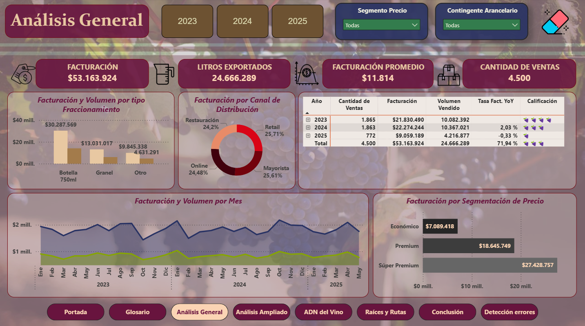
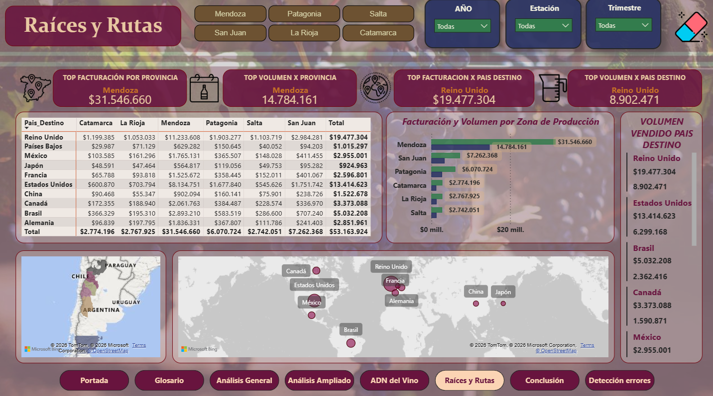
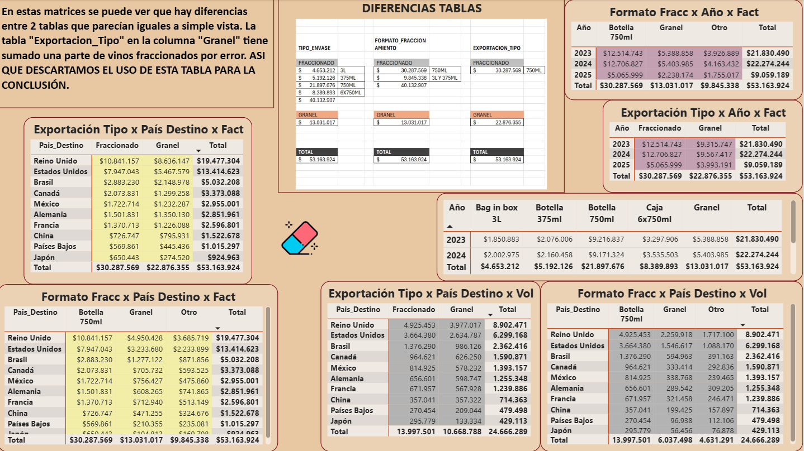

# 🍷 Análisis de Exportaciones de Vino Argentino

## Descripción
Análisis de exportaciones de vino argentino entre 2023 y 2025, 
abarcando 4.500 ventas por un total de $53.163.924 USD.
Trabajo Final del curso Data Analytics — CoderHouse.

## Herramientas utilizadas
- Power BI
- Dataset provisto por la docente del curso

## Páginas del dashboard
- **Análisis General** — KPIs principales, facturación por mes y canal de distribución
- **Análisis Ampliado** — Top 10 bodegas, contingente arancelario y certificaciones
- **ADN del Vino** — Análisis por varietal, tipo de vino y envase
- **Raíces y Rutas** — Facturación por provincia de origen y país destino
- **Detección de Errores** — Inconsistencia detectada en tabla Exportacion_Tipo

## Hallazgo de calidad de datos
Durante el análisis se identificó una inconsistencia en la tabla 
"Exportacion_Tipo": la columna "Granel" incluía por error valores 
de vinos fraccionados. Se descartó dicha tabla para las conclusiones 
y se trabajó con la fuente correcta.

## Conclusiones principales
- Facturación total: $53.163.924 USD en 4.500 ventas
- Mendoza lidera en facturación ($31.546.660) y volumen exportado
- Reino Unido es el principal país destino ($19.477.304)
- El Malbec es el varietal más vendido ($31.386.019)
- El canal Mayorista es el más rentable ($13.670.682)
- Los vinos Súper Premium concentran la mayor facturación ($27.428.757)

## Vista previa del dashboard

